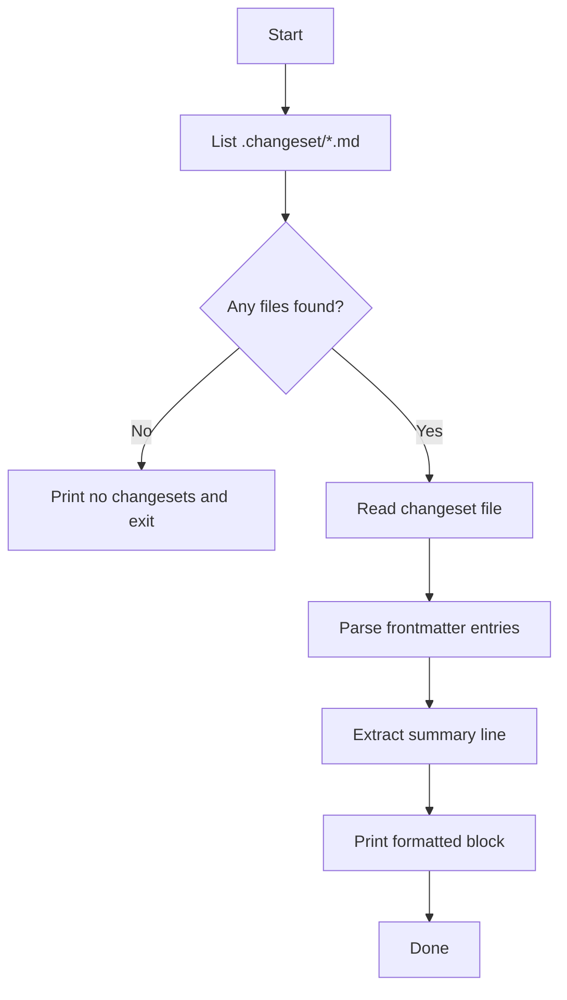

# list-changesets

Lists all changeset files and prints bump entries and summary text.

## Mermaid flow

```mermaid
flowchart TD
  A[Start] --> B[List .changeset/*.md]
  B --> C{Any files found?}
  C -- No --> D[Print no changesets and exit]
  C -- Yes --> E[Read changeset file]
  E --> F[Parse frontmatter entries]
  F --> G[Extract summary line]
  G --> H[Print formatted block]
  H --> I[Done]
```
