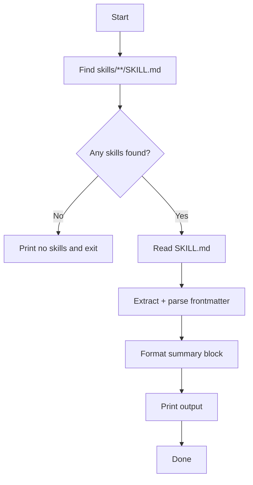

# list-skills

Lists all skills and prints a readable summary of SKILL.md frontmatter.

## Mermaid flow

```mermaid
flowchart TD
  A[Start] --> B[Find skills/**/SKILL.md]
  B --> C{Any skills found?}
  C -- No --> D[Print no skills and exit]
  C -- Yes --> E[Read SKILL.md]
  E --> F[Extract + parse frontmatter]
  F --> G[Format summary block]
  G --> H[Print output]
  H --> I[Done]
```
