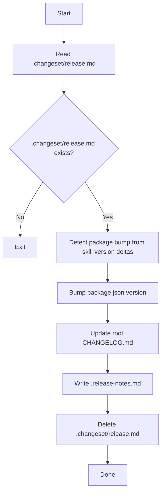

# release-finalize

Finalizes release artifacts on `main`.

Outputs:
- bumps root `package.json` version
- injects `.changeset/release.md` into root `CHANGELOG.md` under `v<package_version>`
- writes `.release-notes.md`
- deletes `.changeset/release.md`

## Mermaid flow

