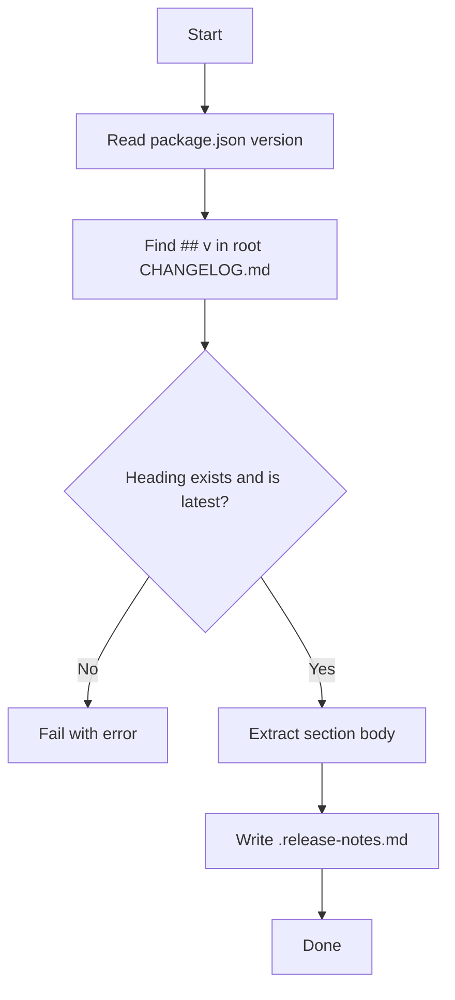

# release-finalize

Finalizes release artifacts on `main`.

Outputs:
- validates that root `CHANGELOG.md` contains `## v<package_version>`
- validates that this heading is the latest (first) H2 section
- writes `.release-notes.md`

## Mermaid flow

