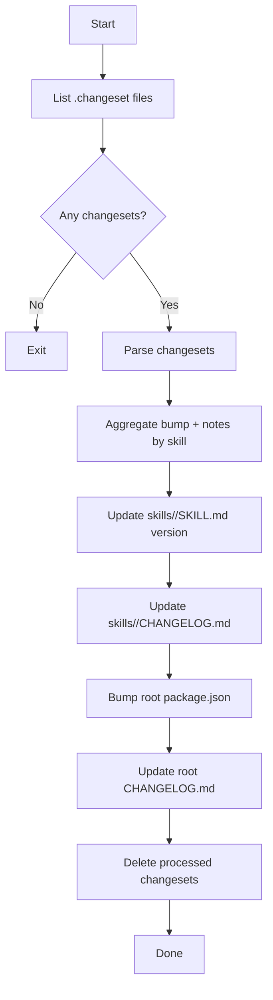

# release-prepare

Applies changesets into release artifacts.

Outputs:
- bumps affected skill `metadata.version`
- updates per-skill `skills/<skill>/CHANGELOG.md`
- updates root `README.md` skills table from discovered `skills/**/SKILL.md`
- bumps root `package.json` version
- updates root `CHANGELOG.md` under latest `## v<package_version>` using grouped `### Major|Minor|Patch` sections with entry separators and package lists
- removes processed `.changeset/*.md`

## Mermaid flow

