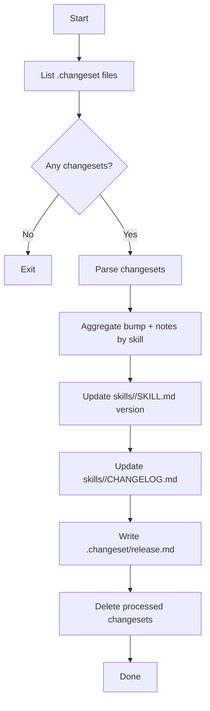

# release-prepare

Applies changesets into release artifacts.

Outputs:
- bumps affected skill `metadata.version`
- updates per-skill `skills/<skill>/CHANGELOG.md`
- removes processed `.changeset/*.md`
- creates `.changeset/release.md`

## Mermaid flow

