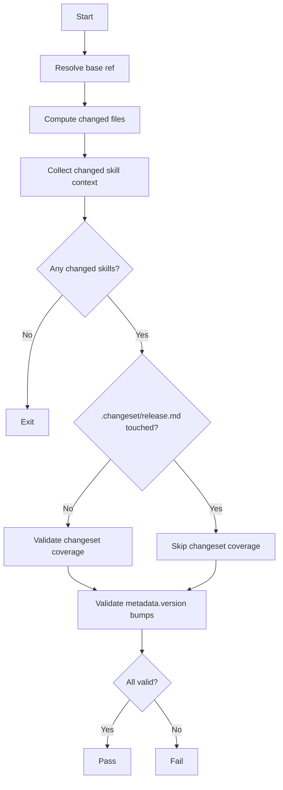

# validate-pr

Validates pull requests that change skills.

Checks:
- changed skills are covered by `.changeset/*.md` (unless release PR)
- changed skills bump `metadata.version`

## Mermaid flow

```mermaid
flowchart TD
  A[Start] --> B[Resolve base ref]
  B --> C[Compute changed files]
  C --> D[Collect changed skill context]
  D --> E{Any changed skills?}
  E -- No --> F[Exit]
  E -- Yes --> G{.changeset/release.md touched?}
  G -- No --> H[Validate changeset coverage]
  G -- Yes --> I[Skip changeset coverage]
  H --> J[Validate metadata.version bumps]
  I --> J
  J --> K{All valid?}
  K -- Yes --> L[Pass]
  K -- No --> M[Fail]
```
