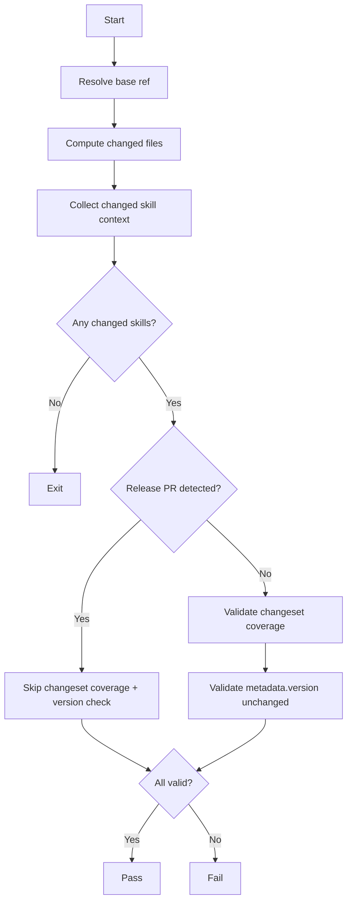

# validate-pr

Validates pull requests that change skills.

Checks:
- changed skills are covered by `.changeset/*.md` (unless release PR)
- existing changed skills keep `metadata.version` unchanged in non-release PRs

## Mermaid flow

