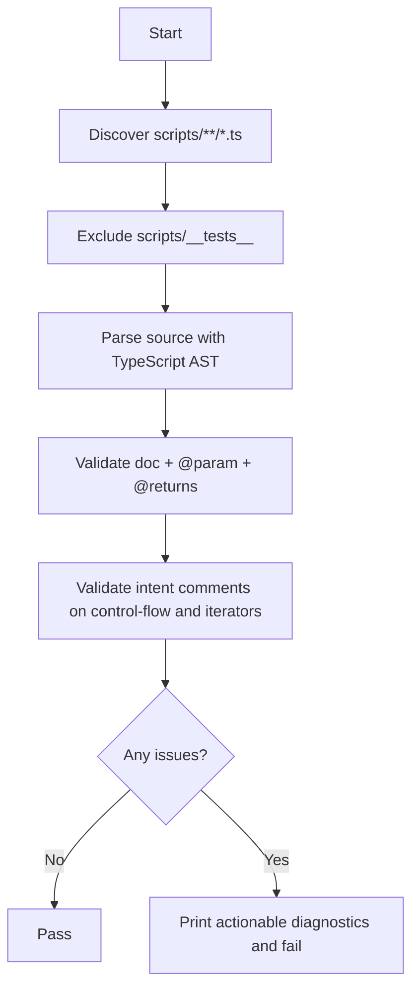

# validate-scripts

Validates TSDoc coverage for function declarations under `scripts/**`.

Checks:
- each function declaration has a TSDoc block,
- each named parameter has an `@param` tag,
- functions returning values include `@returns`,
- control-flow and iterator lines (`if`, `for`, `while`, `map`, `filter`, `reduce`, `forEach`) have intent comments directly above.

Excluded paths:
- `scripts/__tests__/**`

## CLI

- Full scan (default):
  - `bun run validate:scripts`
- Diff-only scan:
  - `bun run validate:scripts --only-diff`
- Diff-only scan against explicit base ref:
  - `bun run validate:scripts --only-diff --base-ref origin/main`

## Mermaid flow

