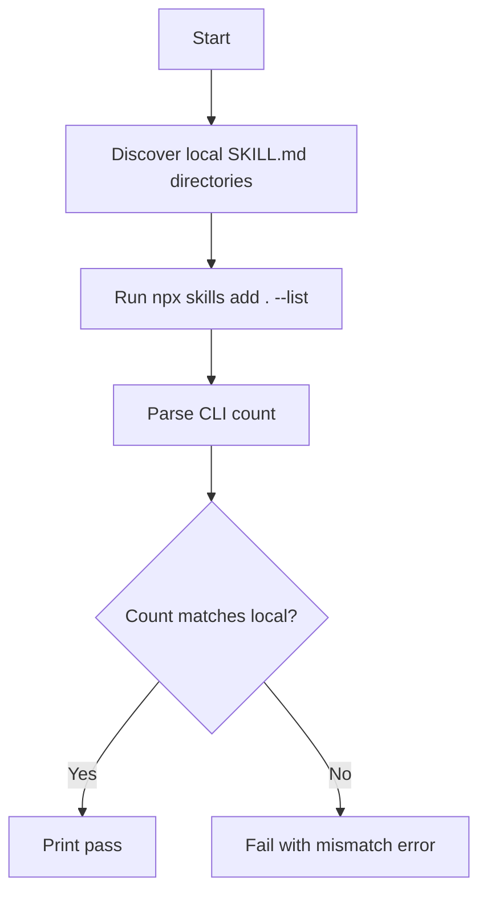

# validate-skills

Validates that discovered local skills match the count reported by the skills CLI.

## Mermaid flow

```mermaid
flowchart TD
  A[Start] --> B[Discover local SKILL.md directories]
  B --> C[Run npx skills add . --list]
  C --> D[Parse CLI count]
  D --> E{Count matches local?}
  E -- Yes --> F[Print pass]
  E -- No --> G[Fail with mismatch error]
```
