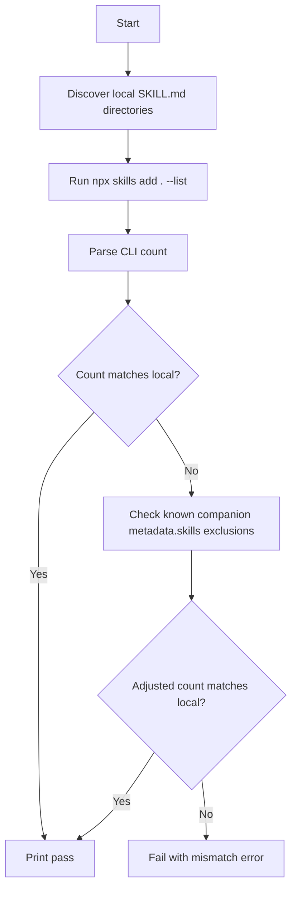

# validate-skills

Validates that discovered local skills match the count reported by the skills CLI.

When a skill uses `metadata.skills` as companion-skill metadata without `metadata.role: "orchestrator"`, the external skills CLI can omit that skill from `--list` output. The validator tolerates this known exclusion pattern by reconciling the mismatch against local frontmatter.

## Mermaid flow

