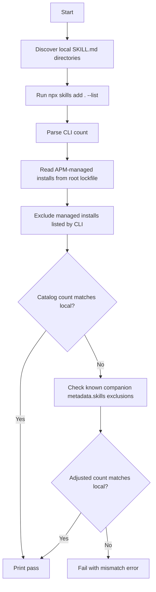

# validate-skills

Validates that discovered local source catalog skills match the count reported by the skills CLI.

Local discovery scans `skills/` recursively, including hidden catalog lanes such as `skills/.deprecated`, `skills/.experimental`, and `skills/.system`. It does not validate `.agents/skills`, because those are materialized agent installs rather than repository source catalog entries.

The skills CLI scans the repository root and can include installed skills under `.agents/skills`. Before comparing counts, the validator reads root `apm.lock.yaml` and excludes CLI-listed skill manifests declared at `.agents/skills/<id>/SKILL.md`. Each exclusion is printed for auditability. Installed skills that are not tracked by the APM lockfile remain mismatches rather than being silently ignored.

When a skill uses `metadata.skills` as companion-skill metadata, the external skills CLI can omit that skill from `--list` output. The validator tolerates this known exclusion pattern by reconciling the mismatch against local frontmatter.

Migration note: `CLI reported skills` remains the raw CLI count, but count comparison now subtracts CLI-listed, APM-managed installs. Repositories using this validator should commit an up-to-date root `apm.lock.yaml` so managed installs are reconciled deterministically.

## Mermaid flow

```mermaid
flowchart TD
  A[Start] --> B[Discover local SKILL.md directories]
  B --> C[Run npx skills add . --list]
  C --> D[Parse CLI count]
  D --> D1[Read APM-managed installs from root lockfile]
  D1 --> D2[Exclude managed installs listed by CLI]
  D2 --> E{Catalog count matches local?}
  E -- Yes --> F[Print pass]
  E -- No --> F1[Check known companion metadata.skills exclusions]
  F1 --> F2{Adjusted count matches local?}
  F2 -- Yes --> F
  F2 -- No --> G[Fail with mismatch error]
```
