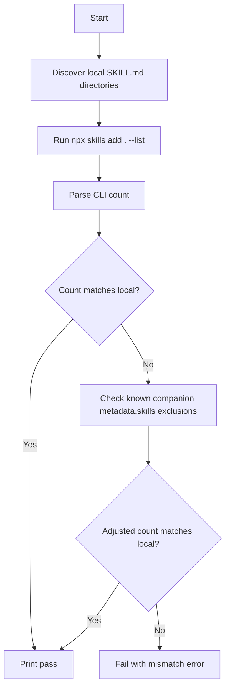

# validate-skills

Validates that discovered local catalog skills match the count reported by the skills CLI.

Local discovery scans `skills/` recursively, including hidden catalog lanes such as `skills/.deprecated`, `skills/.experimental`, and `skills/.system`. It does not scan `.agents/skills`, because those are local agent installs rather than repository catalog entries reported by `npx skills add . --list`.

When a skill uses `metadata.skills` as companion-skill metadata, the external skills CLI can omit that skill from `--list` output. The validator tolerates this known exclusion pattern by reconciling the mismatch against local frontmatter.

## Mermaid flow

```mermaid
flowchart TD
  A[Start] --> B[Discover local SKILL.md directories]
  B --> C[Run npx skills add . --list]
  C --> D[Parse CLI count]
  D --> E{Count matches local?}
  E -- Yes --> F[Print pass]
  E -- No --> F1[Check known companion metadata.skills exclusions]
  F1 --> F2{Adjusted count matches local?}
  F2 -- Yes --> F
  F2 -- No --> G[Fail with mismatch error]
```
